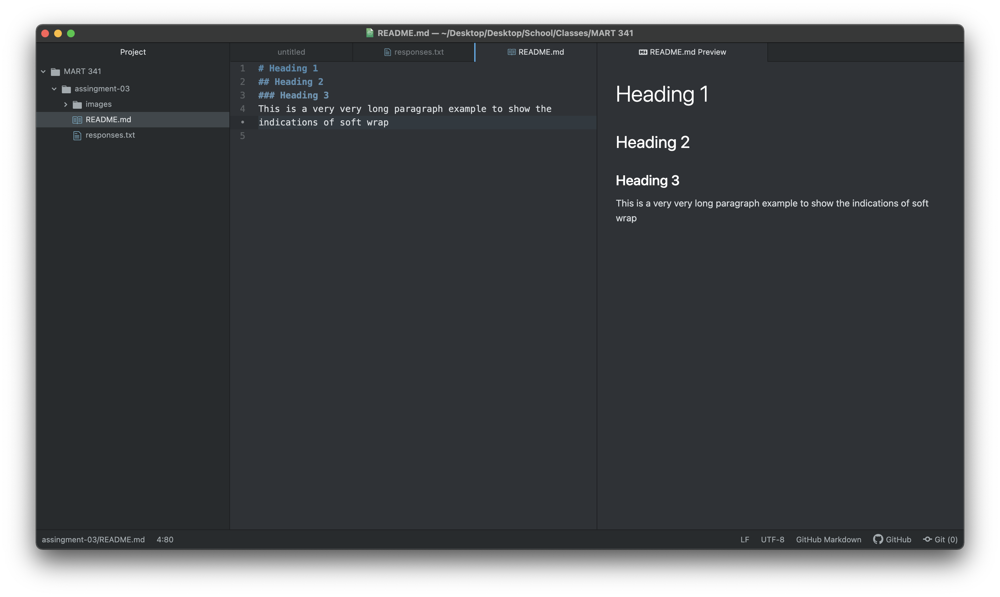

# This is a Heading for my README File

Three things I have learned in this class so far:
1. That the internet uses a combination of electricity, light and radio waves to transport data.
2. That the internet was designed in a way to avoid the full down from a nuclear attack
3. That HTML is the language of the internet and websites

[My Responses](./responses.txt)

