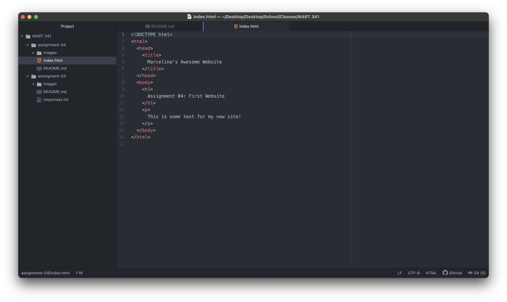

#Assignment 4 README File

Browsers are interpreters of web content that has been received through URL requests. Through the use of multiple engines that will translate information into visual content on the browser. I personally use Chrome and Firefox, for both personal and professional reasons.

