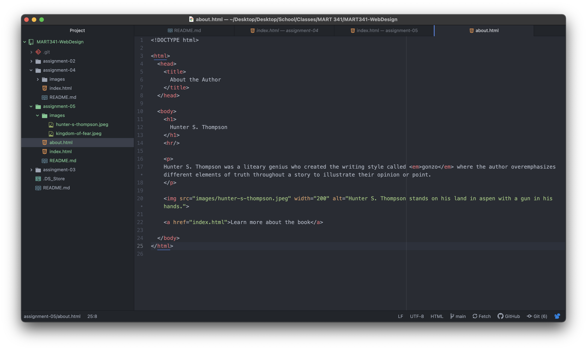

I looked at the Amazon site from 2005. This entire site is complete mess, even more so than it is now. I would argue that Amazon worked on organizing all of its products and offerings on their current site. The site from 2005 is really hard to understand where to even begin and how to search or browse for products.

