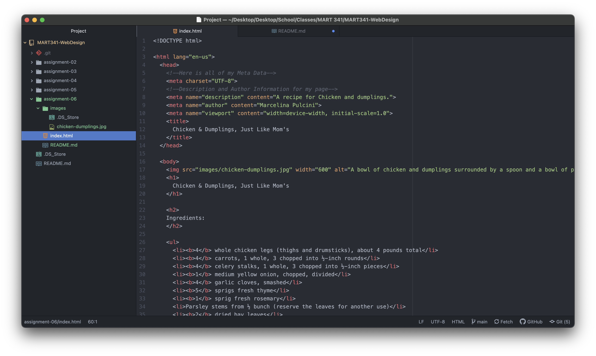

Structural markups are tags that are for embedded information that will guide a user visually like heading and paragraph tags. Semantic markups are used for emphasis like block quotes or using other tags that will add distinguished elements to the words.

