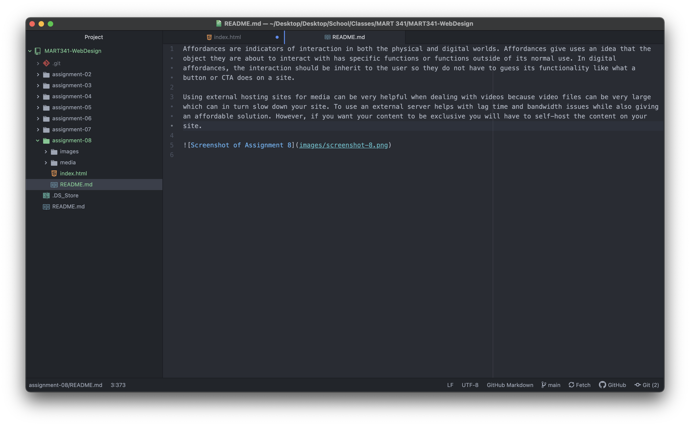

Affordances are indicators of interaction in both the physical and digital worlds. Affordances give uses an idea that the object they are about to interact with has specific functions or functions outside of its normal use. In digital affordances, the interaction should be inherit to the user so they do not have to guess its functionality like what a button or CTA does on a site.

Using external hosting sites for media can be very helpful when dealing with videos because video files can be very large which can in turn slow down your site. To use an external server helps with lag time and bandwidth issues while also giving an affordable solution. However, if you want your content to be exclusive you will have to self-host the content on your site.

