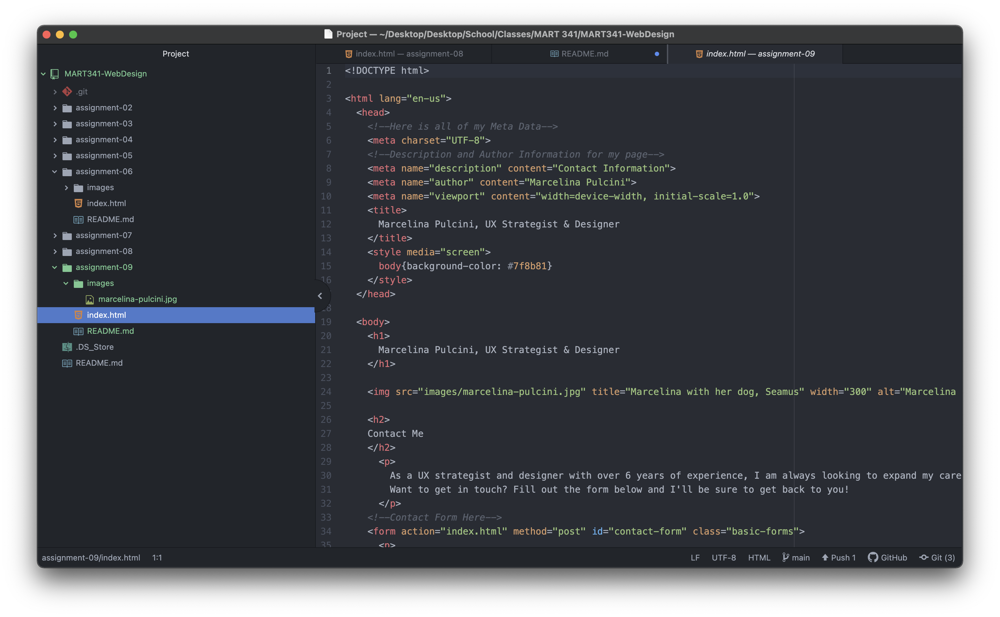

I have done HTML and CSS in the past but I feel like I am finally understanding the hows and whys around the logic for HTML and CSS in general. This class has been super helpful so far in giving me the ability to expand my skills and practice new areas of coding that will help me in my career. I am looking forward to practicing more CSS and getting into the design elements for the second half of the semester.

