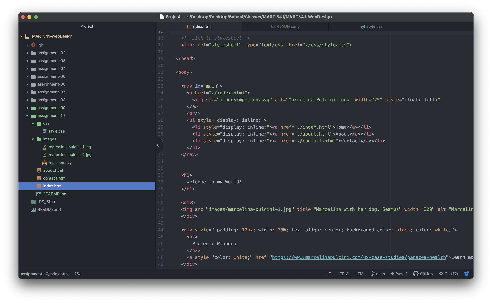

Universal selector is for all elements and will affect everything on the page as a whole. This is best used when you want consistent color stylings or font styles for the entire site. Element selectors are only for specific elements like h2 or h3. This is best used when wanting to affect only that specific element. Class selectors will only affect a class so you can select elements that serve the same function. ID selectors will style a basic element based on it's unique ID.

For my color palette, I was inspired by the sun rising on mountain tops. The deep blues and bright neutrals that shine off the peaks covered in snow.

