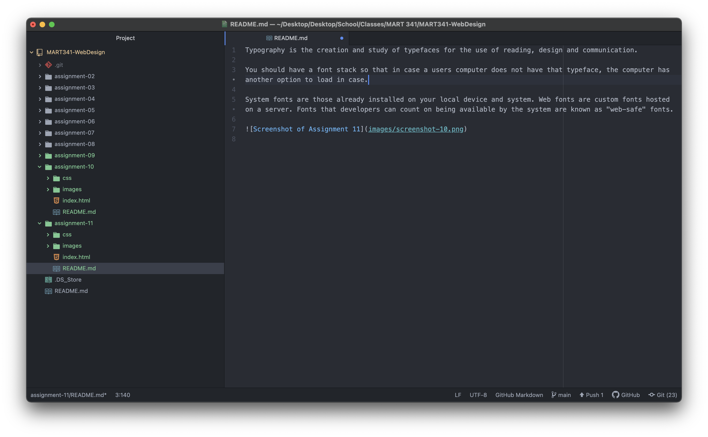

Typography is the creation and study of typefaces for the use of reading, design and communication.

You should have a font stack so that in case a users computer does not have that typeface, the computer has another option to load in case.

System fonts are those already installed on your local device and system. Web fonts are custom fonts hosted on a server. Fonts that developers can count on being available by the system are known as "web-safe" fonts.

