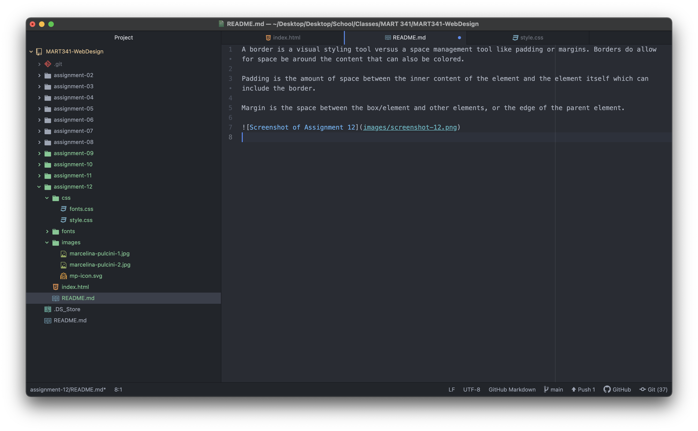

A border is a visual styling tool versus a space management tool like padding or margins. Borders do allow for space be around the content that can also be colored.

Padding is the amount of space between the inner content of the element and the element itself which can include the border.

Margin is the space between the box/element and other elements, or the edge of the parent element.

